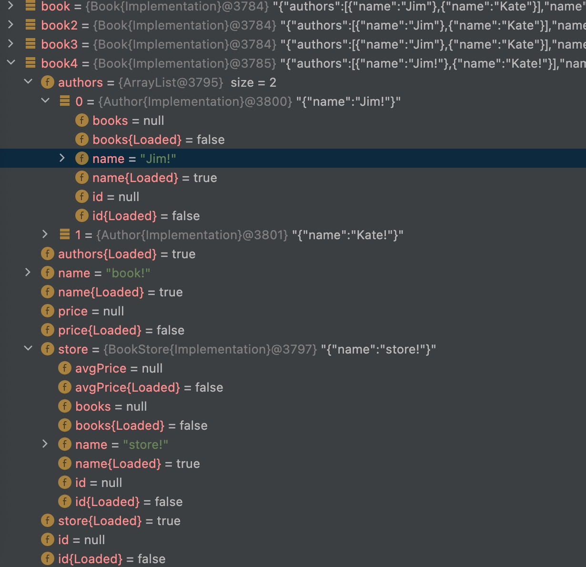

# kimmer

Port "https://github.com/immerjs/immer" for kotlin/jvm.

Create the next immutable state tree by simply modifying the current tree

## Usage

1. Create immutable object from scratch
```kt
val book = new(Book::class).by {
    name = "book"
    store().name = "parent"
    authors() += new(Author::class).by {
        name = "child-1"
    }
    authors() += new(Author::class).by {
        name = "child-2"
    }
}
```

3. Create immutable object based on old immutable object(it looks like modification, it's the core value of this framework)
```kt
val book2 = new(Book::class).by(book) {
    name += "!"
    store().name += "!"
    for (author in authors()) {
        author.name += "!"
    }
}
```

## Step by step guide
Please click [here](doc/get-started.md) to view the guide

## Characteristic

### 1. Dyamic facade

Kimmer is designed for server-side development, so dynamism is important.

1. Take GraphQL as example, its data shape is inherently dynamic.
2. Take ORM as example, not all properties(especially associated properties) is always be queried.

To support this dynamism, kimmer introduced the concept of "unload property", e.g.
```
interface TreeNode: Immutable {
    val name: String
    val childNodes: List<TreeNode>
}
val treeNode = new(TreeNode::class).by {
    name = "RootNode"
}
```
Here
1. The user assigned value to name, so name is a loaded field
2. The user did not assign any value to childNodes, so childNodes is an unloaded field

The behaviors of unloaded property
1. If you try to access unloaded property of object, exception will be thrown *(Just like the classic org.hibernate.LazyIntializationException)*.
2. However, the unloaded properties will not cause exception during json serialization, they will be automatically ignored.

### 2. Static implementation

This framework requires dynamic generation of JVM bytecode, but does not use JDK proxy or CGLIB. Instead generate bytecode directly.

1. Avoid reflection, avoid hash map, keep the performance that a static language should have
2. Avoid complex data structures of data and keep the IDE's debugger simple and clean



As you can see from the picture, the debugger is very clean


## Note
If your JVM version >= 16, you will get an exception
```
java.lang.reflect.InaccessibleObjectException: Unable to make protected final java.lang.Class java.lang.ClassLoader.defineClass(byte[],int,int) throws java.lang.ClassFormatError accessible: module java.base does not "opens java.lang" to unnamed module 
```
In order to resolve this problem, please add 
```
--illegal-access=permit
```
to JVM arguments
