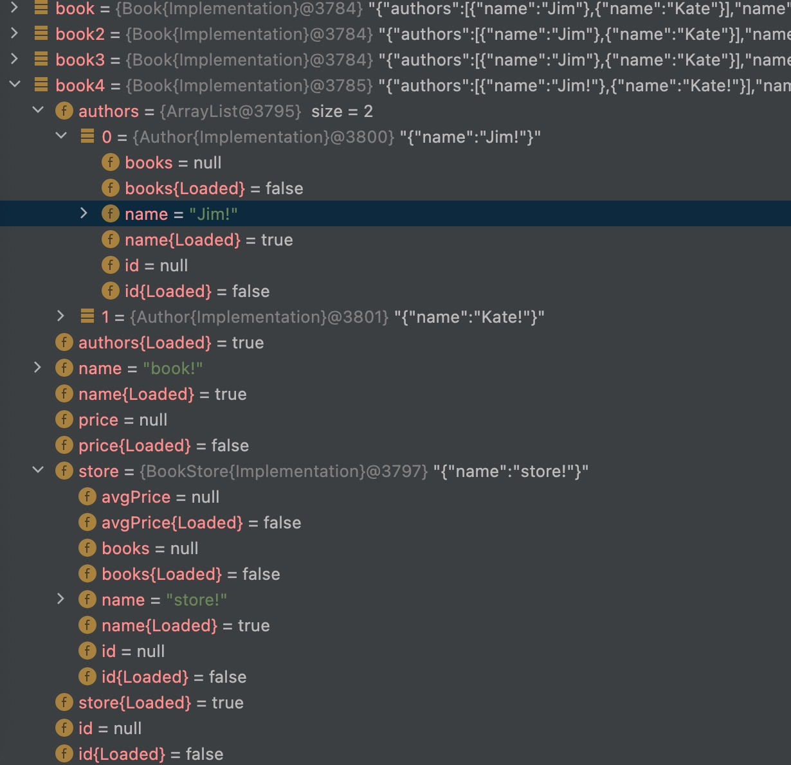

# kimmer

Port [https://github.com/immerjs/immer](https://github.com/immerjs/immer) for kotlin/jvm *(requires kotlin 1.5+)*.

> *Immer is the winner of the "Breakthrough of the year" React open source award and "Most impactful contribution" JavaScript open source award in 2019.*
> 
> *It's simple and powerful, so I bring its design pattern for kotlin/jvm.*

**Create the next immutable state tree by simply modifying the current tree.**

> *If data tree is shallow, kotlin data class's copy function is very simple, but if the data tree is deep, copy function is no longer convenient and kimmer can help you.* 
> 
> *If you're confused by this, please click [here](./doc/value.md) to find out why.* 

## 1. Usage

1. Create immutable object from scratch
```kt
val book = new(Book::class).by {
    name = "book"
    store().name = "parent"
    authors() += new(Author::class).by {
        name = "child-1"
    }
    authors() += new(Author::class).by {
        name = "child-2"
    }
}
```

2. Create immutable object based on old immutable object(it looks like modification, it's the core value of this framework)
```kt
val book2 = new(Book::class).by(book) {
    name += "!"
    store().name += "!"
    for (author in authors()) {
        author.name += "!"
    }
}
```

> For the modification, it looks like the copy-on-write strategy of linux "fork", **unchaged parts are always shared and reused**.

## 2. Step by step guide
Here it is: [step by step guide](doc/get-started.md)

## 3. Documentation

Here it is: [documentation](doc/README.md)

## 4. Characteristic

### 4.1. Dynamic facade

Kimmer is designed for server-side development, so dynamics is important.

1. Take GraphQL as example, its data shape is inherently dynamic.
2. Take ORM as example, not all properties(especially associated properties) always need to be queried.

To support this dynamism, kimmer introduced the concept of "unload property", e.g.
```kt
interface TreeNode: Immutable {
    val name: String
    val childNodes: List<TreeNode>
}
val treeNode = new(TreeNode::class).by {
    name = "RootNode"
}
```
Here
1. The user assigned value to name, so name is a loaded field
2. The user did not assign any value to childNodes, so childNodes is an unloaded field

The behaviors of unloaded property
1. If you try to access unloaded property of object, exception will be thrown *(Just like the classic org.hibernate.LazyIntializationException)*.
2. However, the unloaded properties will not cause exception during json serialization, they will be automatically ignored.

### 4.2. Static implementation

This framework requires dynamic generation of JVM bytecode, but does not use JDK proxy or CGLIB. 

In order to make it as efficient as hand-hardcoding and as clean as hand-hardcoding, it uses [ASM](https://asm.ow2.io/) to generate bytecode directly.

1. Avoid reflection, avoid hash map, keep the performance that a static language should have
2. Avoid complex data structures to keep the IDE's debugger simple and clean



As you can see from the picture, the debugger is very clean
