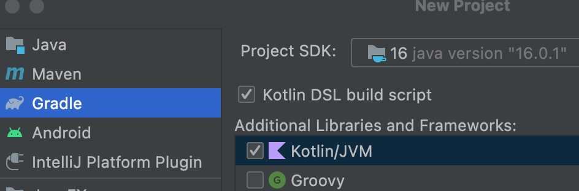
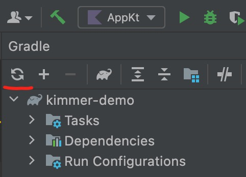
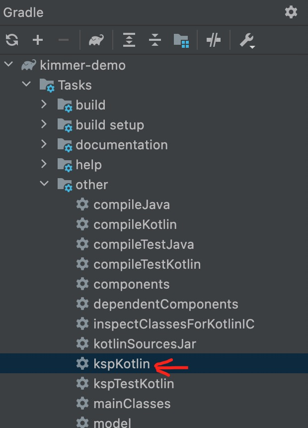

# [Home](https://github.com/babyfish-ct/kimmer)/[kimmer-sql](./README.md)/Get started


## 1. First experience

1. Use Intellij to create a **gradle** project, choose **kotlin/jvm** and **kotlin/dsl**
   

2. Edit the "build.gradle.kts" 

   a. Add this section into **plugin{}**
      ```
      id("com.google.devtools.ksp") version "1.6.10-1.0.2"
      ```
   
   b. Add this section into **dependencies{}**
   
      ```
      implementation("org.babyfish.kimmer:kimmer-sql:0.3.3")
      ksp("org.babyfish.kimmer:kimmer-ksp:0.3.3")
      runtimeOnly("com.h2database:h2:2.1.210")
      ```
   
   c. Add this section into as toppest declaration
      ```
      ksp {
          arg("kimmer.draft", "false")
          arg("kimmer.table", "true")
          arg("kimmer.table.collection-join-only-for-sub-query", "true")
      }
      kotlin {
          sourceSets.main {
              kotlin.srcDir("build/generated/ksp/main/kotlin")
          }
      }
      ```
   
   We configured 3 arguments to ksp.
   
   - "kimmer.draft"
   
      true means to generate source codes of kimmer, its default value is true.

      Let's focus on kimmer-sql, not kimmer. Set it to false.
      
   - "kimmer.table"
      
      true means to generate source codes of kimmer, its default value is false.

      We want to used kimmer-sql, so it must be set to true, this is important.
      
   - "kimmer.table.collection-join-only-for-sub-query"
   
      This argument will be discussed in detail in Chapter "[Contains](./contains.md)", it is recommended to open.
      
3. Refresh gradle to download all dependencies and plugins

   

4. Add data model interfaces
   
   Create a package with any path， add three kotlin files into it

   a. BookStore.kt
   
      ```kt
      package org.babyfish.kimmer.sql.example.model

      import org.babyfish.kimmer.sql.Entity
      import java.util.*

      interface BookStore: Entity<UUID> {
          val name: String
          val website: String?
          val books: List<Book>
      }
      ```
      
   b. Book.kt
   
      ```kt
      package org.babyfish.kimmer.sql.example.model

      import org.babyfish.kimmer.sql.Entity
      import java.math.BigDecimal
      import java.util.*

      interface Book: Entity<UUID> {
          val name: String
          val store: BookStore?
          val edition: Int
          val price: BigDecimal
          val authors: List<Author>
      }
      ```
      
   c. Author.kt
   
      ```kt
      package org.babyfish.kimmer.sql.example.model

      import org.babyfish.kimmer.sql.Entity
      import java.util.*

      interface Author: Entity<UUID> {
          val firstName: String
          val lastName: String
          val fullName: String
          val gender: Gender
          val books: List<Book>
      }

      enum class Gender {
          MALE,
          FEMALE
      }
      ```
      
   Two points to note

   - All database entities must extend *org.babyfish.kimmer.sql.Entity*， its generic parameter must be specified as the type of priamry key, but the business entities itself cannot have generic parameters.
   - Unlike kimmer, kimmer-sql does not allow multiple entity types to be defined in one source code file. Otherwise, the kimmer-ksp precompiler will report an error.

5. Let kimmer-ksp generates extra sources code.

   
   
   Remember we had such a configuration in gradle before?
   
   ```
   kotlin {
       sourceSets.main {
           kotlin.srcDir("build/generated/ksp/main/kotlin")
       }
   }
   ```
   
   It must be ensured that the automatically generated code can be recognized by intellij, otherwise the IDE will not be able to perform intellisense in the subsequent development process.
   
   So, please click refresh button of gradle pannel
   
   
   
   
6. Add other code and run

   You also need to create three files, which can be learned or copied from the example of this project. To save space, the code will not be shown here.
   
   - [example/kimmer-sql/src/main/resources/database.sql](../../example/kimmer-sql/src/main/resources/database.sql)
   
      This file is used to initialize database, create tables and insert data.
      
   - [example/kimmer-sql/src/main/kotlin/org/babyfish/kimmer/sql/example/AppContext.kt](../../example/kimmer-sql/src/main/kotlin/org/babyfish/kimmer/sql/example/AppContext.kt)

      This file used to setup environment
      
      - Uses "database.sql" to create tables and insert data
      - Specify database mapping meta information for the kimmer-sql

   - [example/kimmer-sql/src/main/kotlin/org/babyfish/kimmer/sql/example/App.kt](../../example/kimmer-sql/src/main/kotlin/org/babyfish/kimmer/sql/example/App.kt)
      
      This file is what kimmer-sql wants to present to the user, it's a small but comprehensive example. including
      
      - Dynamic sql
      - Table join
      - Sub quieres
      - Mix DSL and native sql together
      - Pagination

## 2. Key code description

   Let's take a piece of code from [example/kimmer-sql/src/main/kotlin/org/babyfish/kimmer/sql/example/App.kt](../../example/kimmer-sql/src/main/kotlin/org/babyfish/kimmer/sql/example/App.kt) to illustrate.
    
    
   ```kt
    val query = AppContext.sqlClient.createQuery(Book::class) {

        name?.let {
            where(table.name ilike it)
        }

        storeName?.let {
            where(table.store.name ilike it)    // α
        }

        authorName?.let {
            where {
                table.id valueIn subQuery(Author::class) {
                    where(table.fullName ilike it)
                    select(table.books.id)
                }
            }
        }

        orderBy(table.name)
        orderBy(table.edition, OrderMode.DESC)

        select {   // η
            table then
            sql(Int::class, "rank() over(order by %e desc)") {   // γ
                expressions(table.price)
            } then
            sql(Int::class, "rank() over(partition by %e order by %e desc)") {    // δ
                expressions(table.store.id, table.price)    // β
            }
        }
    }

    val countQuery = query
        .reselect {    //ε
            select(table.id.count())
        }
        .withoutSortingAndPaging()    // ζ

    val rowCount = AppContext.jdbc {
        countQuery.execute(this)[0].toInt()
    }
    val pageCount = (rowCount + pageSize - 1) / pageSize
    println("-------------------------------------------------")
    println("Total row count: $rowCount, pageCount: $pageCount")
    println("-------------------------------------------------")
    println()

    for (pageNo in 1..pageCount) {
        println("-----------Page no: $pageNo-----------")
        println()
        val rows = AppContext.jdbc {
            query.limit(pageSize, pageSize * (pageNo - 1)).execute(this)
        }
        for ((book, rank, partitionRank) in rows) {
            println("book object: $book")
            println("global price rank: $rank")
            println("price rank in own store: $partitionRank")
            println()
        }
    }
   ```

   1. Like C#'s LINQ, *select* must must be at the end of lambda of createQuery.
    
      a. Before *select*, queries were mutable objects. Mutable queries have no return type. The following operations always modify the mutable query object itself
       
         - join
         - where
         - groupBy
         - having
         - orderBy
       
      b. After *select*, new query object with return type is returned for you. Typed query objects are lightweight immutable proxies. The following operations do not change the query object itself, but create a new query object.
       
         - reselect
         - withoutSortingAndPaging
         - limit
         - distinct
         - union
         - unionAll
         - minus
         - intersect

   2. Table joins can be initially divided into real joins and phantom joins
    
      - table.stroe.name,  at α
      
         This is real join, because the name of the parent object can only be obtained through table join. 

         It will appear in the final generated SQL. Of course, this real join is defined in dynamic conditions so it will only be generated in SQL if the corresponding condition exists.
      
      - table.store.id, at β
      
         This is phantom join, *Book.store* is a many-to-one association based on foreign key. The id of the parent object is actually the foreign key of the child object. 
         Phantom join never appears in the final SQL.

      kimmer-sql does not require nor encourage developers to think about and differentiate between them.
      
   3. *where* and *orderedBy* are scattered

      In the above code, we use *where* 3 times, but each time is limited to a specific condition, this is called dynamic query.

      > If table joins conflict due to different dynamic conditions, kimmer-sql will merge them. For more details, see [Table joins](./table-joins.md)

   4. SQL DSL and native SQL can mixed together

      In the above code, we called "sql", at *γ* and *δ* 
      
      In the lambda expression of the *sql* function, we use the *expressions* function to inject DSL expressions into native SQL, the arguments correspond one-to-one with *"%e"* in the native sql string template.

      In addition to the *expressions* functions shown here, there are actually another *values* function to inject literal values into native SQL, the arguments correspond one-to-one with *"%v"* in the native sql string template.
      
   5. Special API for pagination
      
      In the above code, we have called two functions
      
      - reselect, at ε
      - withoutSortingAndPaging, at ζ

      They can quickly create the count query based on data queriy, this is very useful for pagination.

      Since the count query does not need *order by* clause, if the *order by* clause of the original query is complex, the count query may have optimization potential. kimmer-sql can automatically optimize the count query. For more details, please check [Pagination](./pagination).

   6. Projection
       
      There are two uses of the select function
       
      - Select one column
       
         ```kt
         select(expr)
         ```
       
      - Select two or more columns
       
         ```kt
         select {
             expr1 then
             expr2 then
             ...
             exprN
         }
         ```
         Unfortuntely, these two spellings are incompatible. For why this is the case, see [not good design to avoid intellij's bug](intellij-bug.md)

## 3. What does kimmer-ksp do?

Recalling the previous steps, we used ksp

```
dependencies {
    ...
    ksp("org.babyfish.kimmer:kimmer-ksp:0.1.6")
}

ksp {
    arg("kimmer.draft", "false")
    arg("kimmer.table", "true")
    arg("kimmer.table.collection-join-only-for-sub-query", "true")
}
```

What does kimmer-ksp do?

kimmer-ksp allows you to write simple code like this

```kt
// table is Aurhor
where(table.books.store.name eq "MANNING")
```
Actually, the low level API is

```kt
// table is Aurhor
where(table.joinList(Author::books).joinReference(Book::store).get(BookStore.name) eq "MANNING")
```

ksp can generate some extension functions for you. *(Use BookStore::store to be example)*

```kt
public val SubQueryTable<Book, UUID>.store: NonNullSubQueryTable<BookStore, UUID>
  get() = joinReference(Book::store)

public val SubQueryTable<Book, UUID>.`store?`: SubQueryTable<BookStore, UUID>
  get() = `joinReference?`(Book::store)

public val Table<Book, UUID>.store: NonNullTable<BookStore, UUID>
  get() = joinReference(Book::store)

public val Table<Book, UUID>.`store?`: Table<BookStore, UUID>
  get() = `joinReference?`(Book::store)
```

So you can use an easier way

```kt
where(table.books.store.name eq "MANNING")
```
    
------------------------------

[Back to parent](./README.md) | [Next: Null Saftey >](./null-safety.md)

